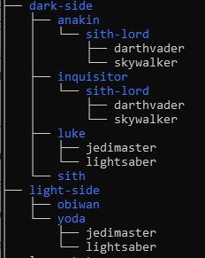
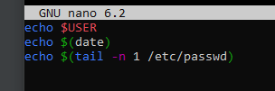
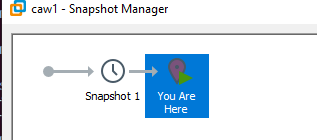

# Übung CAW - Modul 3 - Linux

## Abschnitt 1

1. Unix
2. git
3. Ich darf das Executeable des Programmes verkaufen, muss aber den source code mitliefern  
    GLP bedeutet für mich, dass meine Software Erweiterung ebenfalls GLP sein soll
4. Debian. Die Namen der Debian-Versionen basieren auf Charakteren aus der Toy Story-Filmreihe  
   Jede Debian-Version wird nach einer Figur aus den Toy Story-Filmen benannt, beginnend mit "Buzz" (Debian 1.1) und Charakteren wie "Rex," "Bo," usw.
5. Der Quellcode muss heruntergeladen, auf dem Zielsystem kompiliert und installiert werden, was im Gegensatz zu Ubuntu steht, wo in der Regel vorkompilierte Binärpakete verwendet werden.

## Abschnitt 2

1. "user@user" = Benutzername@Systemname

2. die Option -X gibt es für who nicht, who ist dazu da, informationen über aktuell eingeloggte user auszugeben. Rückgabewert: who: invalid option -- 'X'
   Try 'who --help' for more information.

3. Autovervollständigung von Datei, Programm und Ordnernamen, bzw. werden alle Dateien, Programme und Ordner im aktuellen Directory vorgeschlagen die mit dem vor Tab eingegeben Satz beginnen
4. 
    4.1. man -D, --default  
    Setzt man auf seine default behaviour zurück, wenn optionen in $MANOPT gesetzt wurden  
    4.2. shutdown -r, --reboot  
    reboot der maschine  
    4.3. -d, --delete
    Löschen des Passwortes (=> kein Passwort) eines Users
5. -s, --simulate, --just-print, --dry-run, --recon, --no-act 
6. tree v2.0.2 (c) 1996 - 2022 by Steve Baker, Thomas Moore, Francesc Rocher, Florian Sesser, Kyosuke Tokoro  
    => letze stable version

## Abschnitt 3

1. vim lorem.txt
2. in den editiermodus mittels "i"
3. Escape -> :wq
4. mit / <wort> /g -> wort kommt 2 mal vor
5. :s/Lorem/LOREM

## Abschnitt 4

.

## Abschnitt 5

1. Der Name der Gruppe lautet sudo 
2. Dem Benutzer mit dem ich angemeldet bin
3. Gehört dem root user, weil man sich für das Erstellen Root User Rechte geborgt hat
4. .
5. chmod u+x caw-skript.sh

## Abschnitt 6

1. ip a (192.168.255.128)
2. ip route show (default via 192.168.255.2 dev ens33 proto dhcp metric 100)
3. Standardmäßig wird der TCP Port 22 verwendet, sudo grep Port /etc/ssh/ssh_config
4. ssh user@192.168.255.128
5. scp test.txt 10.0.0.100:/tmp/

## Abschnitt 7

1.

### System-Daten
* /etc alle Konfigurationsdateien
* /var Log-Dateien, Dateien für laufende Dienst
  - Datenbanken → /var/lib/mysql
  - Mailboxen → /var/spool/mail
* /root → Home Ordner für den root User

### Nutzer-Daten
* /home Alle „normalen“ Benutzer besitzen darin einen
Ordner

Sichern, damit wichtige Konfigurationen, 
Benutzerdaten, Anwendungsdaten und Systemprotokolle nicht verloren gehen.

2.

.

