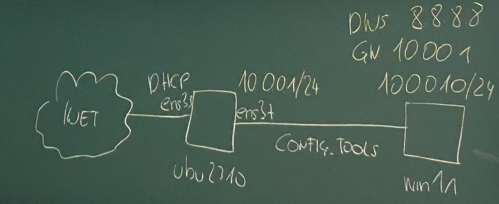

# NWA1, 10.11.23

185.252.72.66/22 ... CIDR Notation/Slash Notation

185.252.72.66 ... Dotted Decimal  
/22 .. Netzmaske

## Config Tools

können verwendet werden um VMs zu vernetzen

### Vorlesungsbeispiel

Eine ubuntu2310 VM ist über CONFIG.TOOLS mit einer win11 VM vernetzt

.

.. ubuntu dient hier als router

dafür muss man ubuntu zum rooter machen mit sudo vi /etc/systemctl.conf

## Linux Dispritutionen

### Ubuntu 

* wurde entwickelt um den Einstieg in Linux zu vereinfachen  

* Verwendet debian packet verwaltung aber hat auch ein distriputionsspezifisches packet verwaltungs
system namens snap

* "Networkmanager" kümmert sich um die Netzwerkverwaltung

* Standarteinstellung bei fast allen Betriebssystemen ist automatische Konfiguration über DHCP

### ip -a

lo: virtuelles netzwerk interface, dient zur netzwerk diagnose (wenn das loop back interface funktioniert
dann funktioniert die grundnetzwerkkonfiguration) und man kann einen dienst am eigenen system
der nicht vom netzwerk ausserhalb zugreifbar sein soll am loopback laufen lassen

### ip route

zeigt das default gateway an

router wissen, wie jedes system im netz erreichbar ist 

### cat /etc/resolv.conf

### ping <ip>

macht standardmäßig 4 pings

### sudo traceroute -n -I www.google.cm

traceroute misst den weg zum ziel, aber nicht den weg zurück 
(weil es technisch unmöglich ist)

